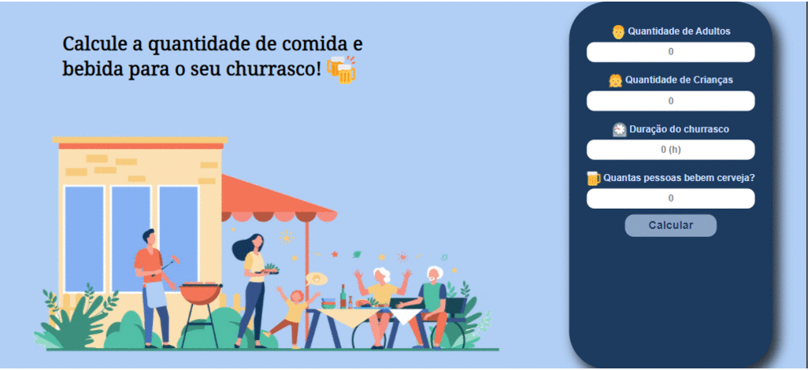

<h1 align="center">
     Churrascômetro
  
</h1>

<h1>
    
</h1>   

<h3 align="center">

[?&style=for-the-badge&logo=gmail&logoColor=white)](mailto:douglas.d.santos.dev@gmail.com) [.svg?&style=for-the-badge&logo=linkedin&logoColor=white)](https://www.linkedin.com/in/douglas-santos-8442b41ba/)

</h3>

<h2 align="center">
   Projeto desenvolvido no curso de FullStack do ProgBR
</h2>
  

---

## 📋 Sobre o Projeto

Programa para **calcular** a quantidade de **comidas** e **bebidas** necessária para o seu churrasco, com base nas seguintes informações:

- **Carne** = 250gr por pessoa  + de 6 horas = 400gr
- **Frango** = 150gr por pessoa + de 6 horas = 300gr
- **Linguiça** = 150gr por pessoa + de 6 horas = 300gr
- **Pao de alho** = 150gr por pessoa + de 6 horas = 300gr
- **Cerveja** = 1500 ml por pessoa que bebem + 6 horas = 2300 ml
- **Refrigerante/agua** = 1000 ml por pessoa + 6 horas = 1500ml
- **criancas** valem por 0,5

---

## 💻 Tecnologias utilizadas

O projeto foi desenvolvido utilizando as seguintes tecnologias:

- **HTML**
- **CSS**
- **JavaScript**

---

## 📕 Licença

Esse projeto está sob a licença MIT. Veja o arquivo [LICENSE](https://github.com/DouglasSantos-code/ChurrasCometro/blob/main/LICENSE) para mais detalhes.

---

Desenvolvido por ⚡ Douglas dos Santos.
